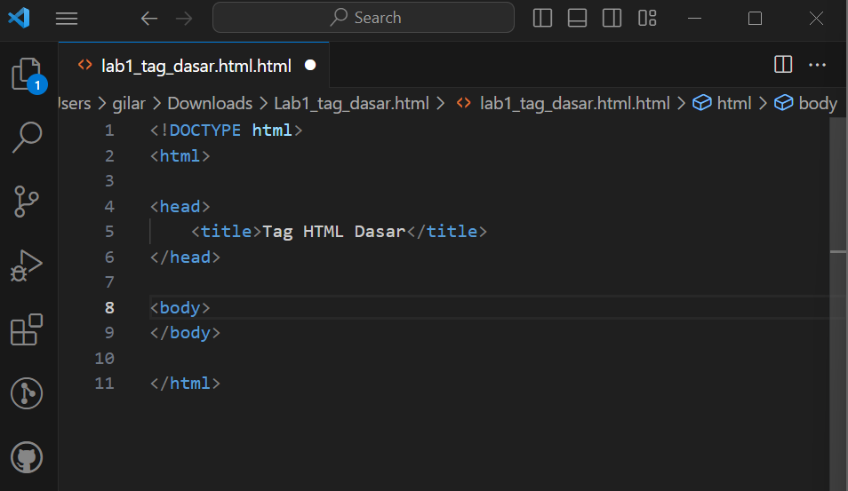
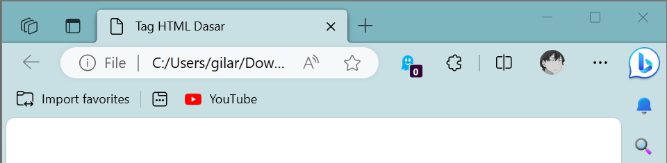
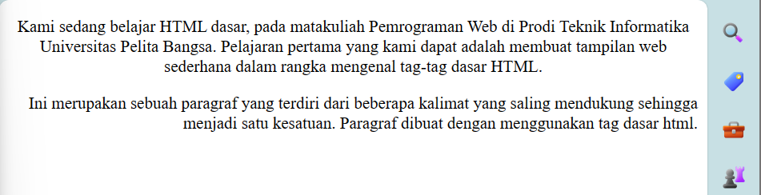
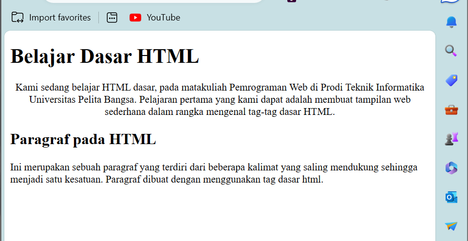
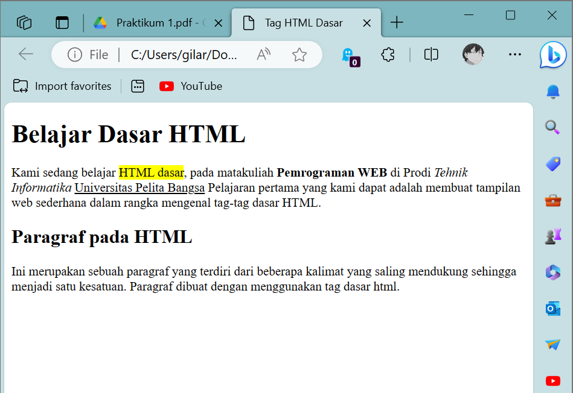
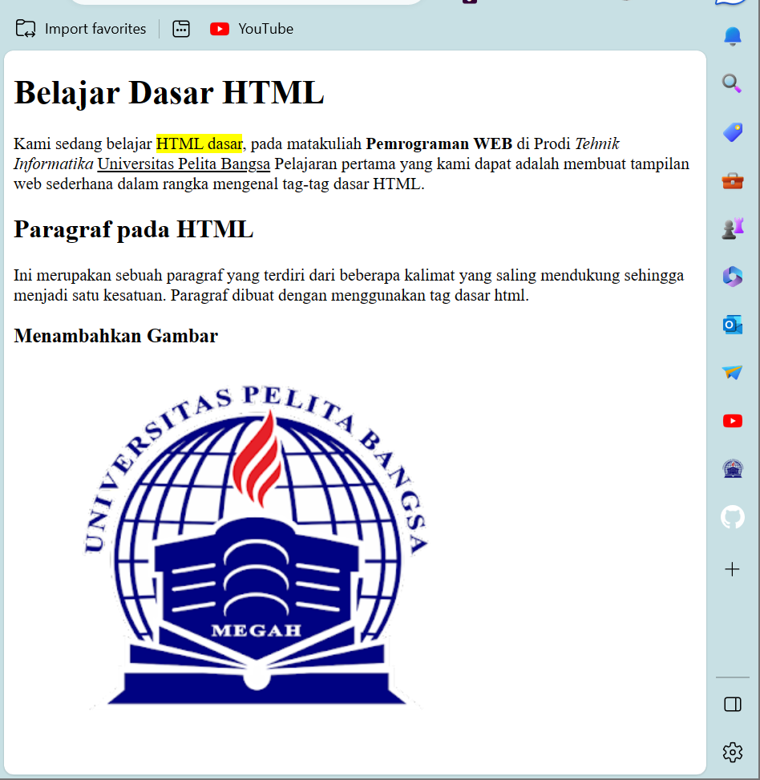
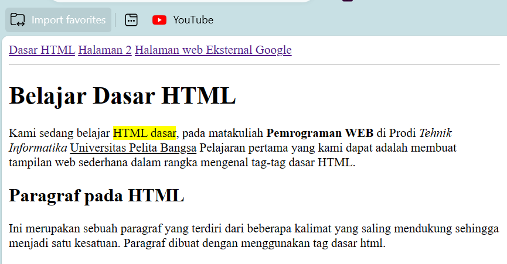

# HTML Dasar
## Profil
| Variable | Isi |
| -------- | --- |
| **Nama** | Gilar Sumilar |
| **NIM** | 312210407 |
| **Kelas** | TI.22.A4 |
| **Mata Kuliah** | Pemrograman WEB |

### Tugas
1. Buatlah repository baru dengan nama Lab1Web.
2. Kerjakan semua latihan yang diberikan sesuai urutannya.
3. Screenshot setiap perubahannya.
4. Buatlah file README.md dan tuliskan penjelasan dari setiap langkah praktikum beserta
screenshotnya.
5. Commit hasilnya pada repository masing-masing.
6. Kirim URL repository pada e-learning ecampus.

## Tampilan awal HTML


#### *Note*
Tag dalam HTML adalah kode yang digunakan untuk mengidentifikasi dan mendefinisikan elemen atau bagian dari halaman web. Tag dimulai dengan tanda kurung sudut (<>) dan berisi nama elemen, seperti `<tag>` untuk membuka elemen dan `</tag>` untuk menutup elemen. Elemen ini membentuk struktur dan tata letak halaman web, serta memungkinkan penampilan dan perilaku yang sesuai. Contohnya, `<title>` adalah elemen yang digunakan untuk menentukan judul halaman web yang akan ditampilkan di tab atau judul jendela browser. Isi dari elemen `<title>` akan muncul sebagai teks di bilah judul browser, memungkinkan pengguna untuk mengidentifikasi halaman web yang mereka buka. 

## Tampilan pada WEB


## 1. Membuat Paragraf
```HTML
<!DOCTYPE html>
<html>
<head>
  <title>Tag HTML Dasar</title>
</head>
<body>
<!-- Ini adalah paragraf pertama -->
<p align="center">Kami sedang belajar HTML dasar, pada matakuliah Pemrograman Web di Prodi
Teknik Informatika Universitas Pelita Bangsa. Pelajaran pertama yang kami dapat
adalah membuat tampilan web sederhana dalam rangka mengenal tag-tag dasar
HTML.</p>
<!-- Ini adalah paragraf kedua -->
<p align="left">Ini merupakan sebuah paragraf yang terdiri dari beberapa kalimat yang saling
mendukung sehingga menjadi satu kesatuan. Paragraf dibuat dengan menggunakan
tag dasar html.</p>
</body>
</html>
```
**Hasil :**



#### *Note :*
`<p>` Adalah tag untuk membuat paragraf.
`<p align="center">` Adalah tag HTML yang digunakan untuk mengatur posisi atau penataan teks dalam elemen paragraf ke tengah (center) dalam halaman web begitu juga dengan left, right dll. Namun, perlu diperhatikan bahwa penggunaan atribut align sudah dihapus dalam HTML5.

## Menambahkan Judul
```HTML
<!DOCTYPE html>
<html>
<head>
  <title>Tag HTML Dasar</title>
</head>
<body>
<!-- Judul Paragraf Pertama -->
<h1>Belajar Dasar HTML</h1>

<!-- Ini adalah paragraf pertama -->
<p align="center">Kami sedang belajar HTML dasar, pada matakuliah Pemrograman Web di Prodi
Teknik Informatika Universitas Pelita Bangsa. Pelajaran pertama yang kami dapat
adalah membuat tampilan web sederhana dalam rangka mengenal tag-tag dasar
HTML.</p>

<!-- Judul Paragraf Kedua -->
<h2>Paragraf pada HTML</h2>

<!-- Ini adalah paragraf kedua -->
<p align="left">Ini merupakan sebuah paragraf yang terdiri dari beberapa kalimat yang saling
mendukung sehingga menjadi satu kesatuan. Paragraf dibuat dengan menggunakan
tag dasar html.</p>
</body>
</html>
```
**Hasil**



#### *Note :*
`<h>` Pada HTML, <h> adalah tag yang digunakan untuk menandai judul atau heading (kepala) dalam dokumen. <h> diikuti dengan angka dari 1 hingga 6, yaitu `<h1>, <h2>, <h3>, <h4>, <h5>, `dan `<h6>`. Setiap angka menunjukkan tingkat atau tingkat kepentingan yang berbeda untuk judul, di mana `<h1>` adalah yang paling tinggi dan `<h6>` adalah yang terendah.

## Format Teks
```HTML
<!DOCTYPE html>
<html>
<head>
  <title>Tag HTML Dasar</title>
</head>
<body>
<!-- Judul Paragraf Pertama -->
<h1>Belajar Dasar HTML</h1>

<!-- Ini adalah paragraf pertama -->
<p align="center"> Kami sedang belajar <mark>HTML dasar</mark>, pada matakuliah <b>Pemrograman WEB</b> di Prodi
<i>Tehnik Informatika</i> <u>Universitas Pelita Bangsa</u> Pelajaran pertama yang kami dapat
adalah membuat tampilan web sederhana dalam rangka mengenal tag-tag dasar
HTML.</p>

<!-- Judul Paragraf Kedua -->
<h2>Paragraf pada HTML</h2>

<!-- Ini adalah paragraf kedua -->
<p align="left">Ini merupakan sebuah paragraf yang terdiri dari beberapa kalimat yang saling
mendukung sehingga menjadi satu kesatuan. Paragraf dibuat dengan menggunakan
tag dasar html.</p>
</body>
</html>
```
**Hasil :**



#### *Note :*
Format dalam HTML mengacu pada cara mendesain dan mempresentasikan konten teks, gambar, dan elemen lain pada halaman web. Format memungkinkan Anda untuk mengubah tata letak, gaya, dan penampilan halaman web agar lebih menarik dan mudah dibaca. Beberapa elemen dan properti format paling umum dalam HTML meliputi:

1. **Tag `<p>` (Paragraf):**
   Menggunakan tag `<p>` untuk mengelompokkan teks ke dalam paragraf terpisah, memberikan struktur dan membantu memisahkan konten.

2. **Tag `<b>` (Bold) dan `<strong>`:**
   Tag `<b>` digunakan untuk membuat teks menjadi tebal (bold), sedangkan `<strong>` memberikan penekanan penting pada teks. `<strong>` memiliki arti semantik yang lebih kuat daripada `<b>`, lebih penting untuk aksesibilitas dan SEO.

3. **Tag `<i>` (Italic) dan `<em>`:**
   Tag `<i>` digunakan untuk membuat teks menjadi miring (italic), sedangkan `<em>` memberikan penekanan pada teks, sering digunakan untuk kata atau frase yang dianggap penting.

4. **Tag `<u>` (Underline):**
   Tag `<u>` digunakan untuk menggarisbawahi teks. Namun, penggunaan ini tidak disarankan karena dapat membingungkan pengguna karena seringkali garis bawah dianggap sebagai tautan.

5. **Tag `<br>` (Line Break):**
   Tag `<br>` digunakan untuk membuat perubahan baris tanpa membuat paragraf baru, berguna untuk memisahkan teks dalam satu paragraf.

6. **Tag `<hr>` (Horizontal Rule):**
   Tag `<hr>` digunakan untuk membuat garis horizontal, memisahkan konten secara visual.

7. **Properti CSS (Cascading Style Sheets):**
   Penggunaan CSS untuk mengatur tata letak, warna, ukuran teks, margin, padding, dan berbagai gaya presentasi lainnya. Properti CSS mencakup font-family, color, background, margin, padding, dan banyak lagi.

8. **Tag `<ul>` (Unordered List) dan `<ol>` (Ordered List):**
   Tag `<ul>` digunakan untuk membuat daftar tak berurutan (bullet points), sedangkan `<ol>` digunakan untuk membuat daftar terurut (dengan angka atau huruf).

9. **Tag `<blockquote>` (Block Quote):**
   Tag `<blockquote>` digunakan untuk menandai teks kutipan atau blok teks yang dikutip dari sumber lain.

## Menyisipkan Gambar
```HTML
<!DOCTYPE html>
<html>
<head>
  <title>Tag HTML Dasar</title>
</head>
<body>
<!-- Judul Paragraf Pertama -->
<h1>Belajar Dasar HTML</h1>

<!-- Ini adalah paragraf pertama -->
<p align="center"> Kami sedang belajar <mark>HTML dasar</mark>, pada matakuliah <b>Pemrograman WEB</b> di Prodi
<i>Tehnik Informatika</i> <u>Universitas Pelita Bangsa</u> Pelajaran pertama yang kami dapat
adalah membuat tampilan web sederhana dalam rangka mengenal tag-tag dasar
HTML.</p>

<!-- Judul Paragraf Kedua -->
<h2>Paragraf pada HTML</h2>

<!-- Ini adalah paragraf kedua -->
<p align="left">Ini merupakan sebuah paragraf yang terdiri dari beberapa kalimat yang saling
mendukung sehingga menjadi satu kesatuan. Paragraf dibuat dengan menggunakan
tag dasar html.</p>

<!-- sub judul paragraf -->
<h3>Menambahkan Gambar</h3>
<!-- menambahkan gambar pada dokumen -->

</body>
</html>
```
**Hasil :**



#### *Note :*
Untuk memunculkan gambar pada HTML jika gambar tersebut ada dalam file lokal di komputer atau server, Anda dapat menggunakan elemen `` (image) dengan atribut src (source) untuk menunjukkan lokasi file gambar.
`width` Gambar akan ditampilkan apa adanya sesuai dengan ukuran aslinya. Untuk mengatur ukuran
gambar, dapat digunakan atribut witdh dan height dengan nilai integer yang disesuaikan.

## Menambahkan Hyperlink
```HTML
<!DOCTYPE html>
<html>

<head>
    <title>Tag HTML Dasar</title>
</head>

<body>
    <!-- Menambahkan nlink navigasi-->
    <nav>
        <a href="lab1_tag_dasar.html.html" target="_blank">Dasar HTML</a>
        <a href="lab1_halaman2.html" target="_blank">Halaman 2</a>
        <a href="http://www.google.com">Halaman web Eksternal Google</a>
    </nav>
    <hr>
    <!-- Judul Paragraf Pertama -->
    <h1>Belajar Dasar HTML</h1>

    <!-- Ini adalah paragraf pertama -->
    <p align="left">
        Kami sedang belajar <mark>HTML dasar</mark>, pada matakuliah <b>Pemrograman WEB</b> di Prodi
        <i>Tehnik Informatika</i> <u>Universitas Pelita Bangsa</u> Pelajaran pertama yang kami dapat
        adalah membuat tampilan web sederhana dalam rangka mengenal tag-tag dasar
        HTML.
    </p>

    <!-- Judul Paragraf Kedua -->
    <h2>Paragraf pada HTML</h2>

    <!-- Ini adalah paragraf kedua -->
    <p align="left">
        Ini merupakan sebuah paragraf yang terdiri dari beberapa kalimat yang saling
        mendukung sehingga menjadi satu kesatuan. Paragraf dibuat dengan menggunakan
        tag dasar html.
    </p>

    <!-- Sub Judul Paragraf -->
    <h3>Menambahkan Gambar</h3>

    <!-- Menambahkan gambar pada dokumen -->
    
</body>

</html>
```
**Hasil :**



#### *Note :*
`<a>` (anchor) dalam HTML digunakan untuk membuat tautan atau hyperlink yang menghubungkan ke halaman web, sumber daya, atau bagian-bagian tertentu dari halaman yang sama. Fungsi utamanya adalah memungkinkan navigasi antara berbagai dokumen atau bagian-bagian dalam dokumen yang sama.

target:

Atribut ini menentukan di mana tautan akan membuka konten yang ditautkan. Beberapa nilai umum termasuk:

1. `"_self":` Membuka tautan dalam jendela atau tab yang sama (default).
2. `"_blank":` Membuka tautan dalam tab atau jendela baru.
3. `"_parent":` Membuka tautan di dalam frame induk jika ada.
4. `"_top":` Membuka tautan di dalam jendela paling atas.

### Jawab Pertanyaan Berikut

1. Lakukan perubahan pada kode sesuai dengan keinginan anda, amati perubahannya adakah
error ketika terjadi kesalahan penulisan tag?
2. Apa perbedaan dari tag `<p>` dengan tag `<br>`, berikan penjelasannya!
3. Apa perbedaan atribut title dan alt pada tag``, berikan penjelasannya!
4. Untuk mengatur ukuran gambar, digunakan atribut width dan height. Agar tampilan gambar
proporsional sebaiknya kedua atribut tersebut diisi semua atau tidak? Berikan penjelasannya!
5. Pada link tambahkan atribut target dengan nilai atribut bervariasi `( _blank, _self, _top,
_parent )`, apa yang terjadi pada masing-masing nilai antribut tersebut?

#### *Note :*
! Penjelasan sudah mengandung jawaban pada soal di atas


